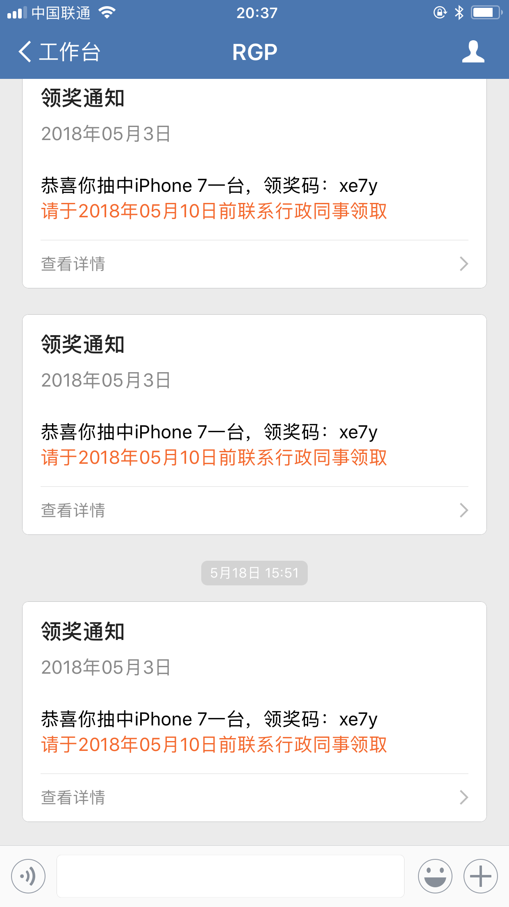

# 企业微信 Java Client

## Usage
### 1、Add dependency
``` java
<dependency>
    <groupId>com.dhph.pub</groupId>
    <artifactId>qyapi-wechat-sdk</artifactId>
    <version>0.0.2</version>
</dependency>

```

### 2、Configuration

``` java
@Configuration
@Data
public class CorpWechatConfig {

    @Value("${corp.wechat.corpId}")
    private String corpId;

    @Value("${corp.wechat.secret}")
    private String secret;

    @Value("${corp.wechat.agentId}")
    private String agentId;

    @Bean
    public CorpWeChatService corpWeChatService() {
        return new CorpWeChatService(corpId, secret, agentId);
    }
}

```

### 3、Invoke in java code

``` java
    List<String> tags = new ArrayList<>();
    tags.add("1"); // java 开发
    // 发送给指定tag ，标签ID列表，多个接收者用‘|’分隔，最多支持100个。当touser为@all时忽略本参数
    corpWeChatService.sendByTag(tags, "领奖通知", "<div class=\"gray\">2018年05月3日</div> <div class=\"normal\">恭喜你抽中iPhone 7一台，领奖码：xe7y</div><div class=\"highlight\">请于2018年05月10日前联系行政同事领取</div>");

    List<String> users = new ArrayList<>();
    users.add("qy01eaba0fa6470db69cb58a4633");
    // 发送给指定用户，成员ID列表（消息接收者，多个接收者用‘|’分隔，最多支持1000个）。特殊情况：指定为@all，则向关注该企业应用的全部成员发送
    corpWeChatService.sendByUser(users, "领奖通知", "<div class=\"gray\">2018年05月3日</div> <div class=\"normal\">恭喜你抽中iPhone 7一台，领奖码：xe7y</div><div class=\"highlight\">请于2018年05月10日前联系行政同事领取</div>");

    // 部门ID：1842014604 研发部
    List<String> partys = new ArrayList<>();
    partys.add("1842014604");
    // 发送给指定部门， 部门ID列表，多个接收者用‘|’分隔，最多支持100个。当touser为@all时忽略本参数
    // corpWeChatService.sendByParty(partys, "企业应用消息测试。不用理。");

```

### 4、showcase


